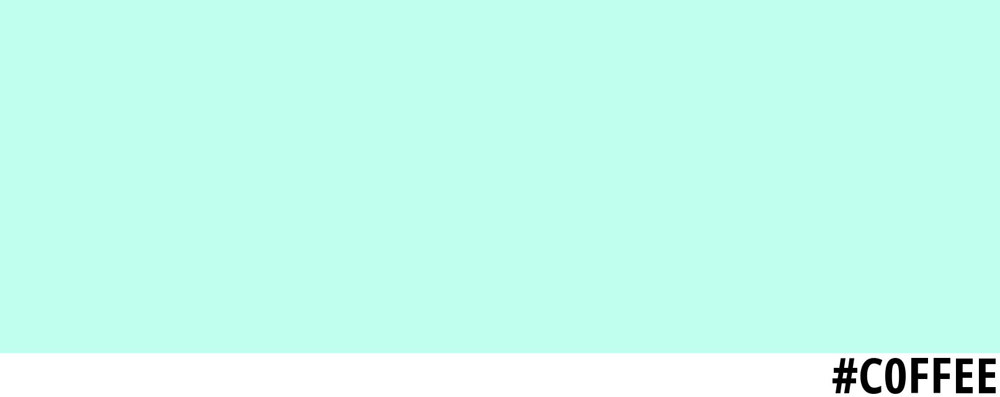

# hexcode-to-mug

Generates mug templates from a given hexcode like in the example below.

## How To Use

Run the script by using `python app.py <COLOUR>` where colour is either 6 hexadecimal digits long, but can also be 3. If the colour is 3 digits long, each digit will be copied where the copy will go next. For example `123` will become `112233`. This was inspired by the CSS colour format.
